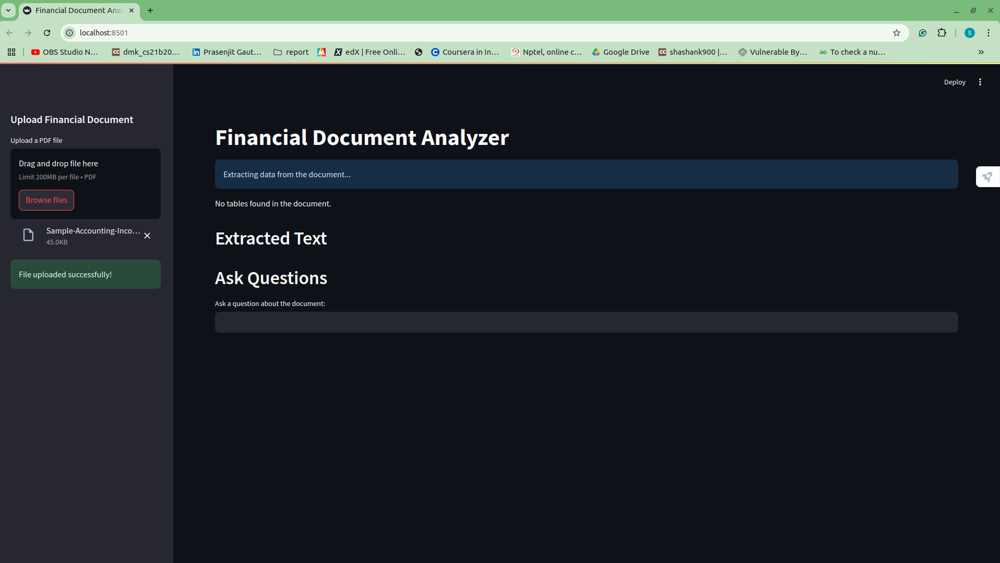

# Financial Document Analyzer

A Streamlit-based chatbot that allows users to upload financial documents, extract textual data, and ask questions about the document's content using an AI-powered model.

---

## Features

- Upload financial documents (PDF format).
- Extract text and table data from uploaded documents.
- Ask questions related to the extracted content.
- AI-powered responses to queries based on document context.

---

## Interface Preview

---

